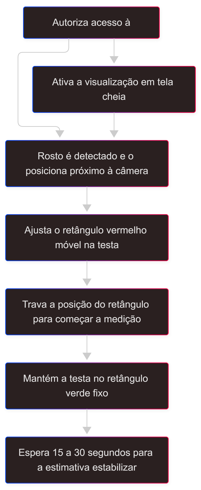

<a id="topo"></a>

[![DOI][doi-shield]][doi-url]
[![Contributors][contributors-shield]][contributors-url]
[![Forks][forks-shield]][forks-url]
[![Stargazers][stars-shield]][stars-url]
[![Issues][issues-shield]][issues-url]
[![Unlicense License][license-shield]][license-url]
[![LinkedIn][linkedin-shield]][linkedin-url]

<!-- PROJECT LOGO -->
<br />
<div align="center">
  <a href="https://github.com/DanielKGM/heartcam">
    
  </a>

<h3 align="center">HeartCam: Batimentos Cardíacos <i>Online</i></h3>

  <p align="center">
    <strong>HeartCam</strong> é uma aplicação <i>web</i> que estima <strong>batimentos cardíacos</strong> em tempo real, a partir das <strong>câmeras</strong> de dispositivos móveis ou computadores.
    <br />
    <br />
    <a href="https://heartcam.koyeb.app/"><strong>ACESSAR <i>WEBSITE</i> »</strong></a>
    <br />
    <br />
    <a href="https://github.com/github_username/repo_name/issues/new?labels=bug&template=bug-report---.md">Reportar Erro</a>
    &middot;
    <a href="https://github.com/github_username/repo_name/issues/new?labels=enhancement&template=feature-request---.md">Sugerir Algo</a>
  </p>
</div>


<!-- TABLE OF CONTENTS -->
<details>
  <summary><b>Clique Aqui</b> para Exibir o Sumário</summary>
  <ol>
    <li>
      <a href="#sobre-o-projeto">Sobre o Projeto</a>
      <ul>
        <li><a href="#principais-tecnologias">Principais Tecnologias</a></li>
      </ul>
    </li>
    <li>
      <a href="#instalação-local">Instalação Local</a>
      <ul>
        <li><a href="#pré-requisitos">Pré-Requisitos</a></li>
        <li><a href="#instalação">Instalação</a></li>
      </ul>
    </li>
    <li><a href="#usando-o-heartcam">Usando o HeartCam</a></li>
    <li><a href="#contato">Contato</a></li>
    <li><a href="#licença-e-citação">Licença e Citação</a></li>
    <li><a href="#agradecimentos">Agradecimentos</a></li>
  </ol>
</details>


## Sobre o Projeto

[![Screenshot Produto][screenshot-produto]](https://heartcam.koyeb.app/)

<div align="justify">
O <b>HeartCam</b> é um sistema desenvolvido para fotopletismografia remota (rPPG), um monitoramento não invasivo de sinais vitais. Utilizando a técnica de <i>Eulerian Video Magnification</i> (EVM) e análise espectral (FFT), o sistema consegue detectar as micro-variações de cor na pele causadas pela circulação sanguínea, invisíveis a olho nu.
<br/><br/>
Este projeto foi desenvolvido para a disciplina Processamento de Imagens (2025.2) da Universidade Federal do Maranhão (UFMA). Seu algorítmo de magnificação de vídeo baseia-se em:
</div><br/>

> WU, Hao-Yu et al. <b>Eulerian Video Magnification for Revealing Subtle Changes in the World</b>. ACM Transactions on Graphics (Proc. SIGGRAPH 2012), v. 31, n. 4, 2012. Disponível em: <<a href="https://people.csail.mit.edu/mrub/evm/">https://people.csail.mit.edu/mrub/evm/</a>>.

<p align="right">(<a href="#topo">voltar ao topo</a>)</p>

### Principais Tecnologias

|  | Aplicação |
|---------|---------------|
| [](#) | Linguagem principal do <i>backend</i> e processamento de dados. |
| [](#) | <i>Framework web</i> para gerenciamento de rotas e servidor. |
| [](#) | Cálculos matemáticos, manipulação de arrays e FFT. |
| [](#) | Visão computacional, detecção facial (Haar Cascades) e construção de pirâmides gaussianas para o algoritmo EVM. |
| [](#) | Comunicação bidirecional em tempo real entre cliente e servidor. |
| [](#) | Estilização da interface e componentes responsivos. |
| [](#) [](#) | Lógica do cliente e gráficos dinâmicos. |
| [](#) | Estrutura semântica das páginas web. |
| [](#) | Containerização da aplicação para fácil distribuição e <i>deploy</i>. |

<p align="right">(<a href="#topo">voltar ao topo</a>)</p>


<!-- GETTING STARTED -->
## Instalação Local

<p align="justify">Siga este guia passo a passo para configurar e rodar o </b>HeartCam</b> no seu computador pessoal. Você pode optar por rodar via <b>Python</b> (recomendado para desenvolvimento) ou <b>Docker</b> (recomendado para uso prático isolado).</p>

### Pré-requisitos

Antes de começar, certifique-se de que sua máquina possui as ferramentas necessárias instaladas.

* **Git** (Sistema de Controle de Versão)
    * _Windows/Linux:_ [Baixar Git](https://git-scm.com/downloads).

* **Python** (Versão 3.9 ou Superior)
    * _Windows:_ [Baixar Python Installer](https://www.python.org/downloads/).
    * _Linux:_ Geralmente já vem instalado. Verifique com `python3 --version`. Se necessário: `sudo apt-get install python3 python3-pip`.

* **Docker** (Opcional - Apenas se Escolher este Método)
    * _Windows:_ [Instalar Docker Desktop](https://www.docker.com/products/docker-desktop/).
    * _Linux:_ [Instalar Docker Engine](https://docs.docker.com/engine/install/).
    * [Tutorial Completo](https://gist.github.com/marciojg/1e6a3cf3d3cd2bf7b3e87dad259142d9).

### Instalação

#### **1º PASSO: Obtenha o Código Fonte**
   
Você pode clonar o repositório usando o Git ou baixar o arquivo ZIP manualmente.

* **Opção A: Via Git Clone (Recomendado)**

  Abra seu terminal e execute:
 
   ```sh
   git clone https://github.com/DanielKGM/heartcam.git
   ```

* **Opção B: Via Download ZIP**

    1. Clique no botão verde **Code** no topo desta página.
    2. Selecione **Download ZIP**.
    3. Extraia o conteúdo para uma pasta de sua preferência.

#### **2º PASSO: Acesse a Pasta do Projeto**

Abra o terminal de comandos do seu sistema operacional e execute o seguinte comando, substituindo todo texto entre colchetes (colchetes inclusos) pelo diretório em que foi baixado o projeto no passo anterior:

```sh
cd [DIRETÓRIO EM QUE FOI BAIXADO]
```

#### **3º PASSO: Execute a Aplicação**

Escolha **apenas um** dos métodos abaixo para rodar o projeto.

* **Método A: Rodando com Python (Ambiente Virtual)**

  Este método é ideal se você deseja modificar o código ou não quer instalar o Docker. Siga a sequência de números gregos e execute os comandos de acordo com seu sistema operacional:

    ```sh
    # I. Crie o ambiente virtual
    python -m venv .venv
    # No Linux, se der erro, use: python3 -m venv .venv

    # II. Espere gerar os arquivos e ative o ambiente virtual
    .\.venv\Scripts\Activate.ps1 # Windows PowerShell
    .\.venv\Scripts\activate.bat # Windows CMD
    source .venv/bin/activate # Linux/MAC

    # III. Instale as dependências do projeto
    pip install -r requirements.txt

    # IV. Inicie o servidor
    python app.py
    ```

* **Método B: Rodando com Docker**

  Este método garante que a aplicação rode em um ambiente isolado e idêntico ao do website, sem precisar instalar Python ou bibliotecas manualmente.

  1. Abra o programa Docker Desktop (Windows) ou rode o serviço Docker (Linux/MAC) pelo comando: `sudo systemctl start docker`
  2. Construa a imagem (Build) com o comando `docker build -t heartcam .`
  3. Rode o container pelo comando `docker run -p 5000:5000 heartcam`

#### **4º PASSO: Visualize no Navegador**

Após iniciar o servidor (pelo Método A ou B) sem erros, o serviço está ativo (geralmente na porta 5000).

* Abra seu navegador preferido (Chrome, Firefox, Edge).
* Acesse o endereço local: [http://127.0.0.1:5000](http://127.0.0.1:5000) ou [http://localhost:5000](http://localhost:5000).
* Permita o acesso à câmera quando solicitado pelo navegador.

<p align="right">(<a href="#topo">voltar ao topo</a>)</p>


<!-- USAGE EXAMPLES -->
## Usando o **HeartCam**

### Diagrama de Fluxo do Usuário

<div align="center">

</div>

### Orientações

-

<p align="right">(<a href="#topo">voltar ao topo</a>)</p>


<!-- CONTACT -->
## Contato

[Daniel Campos Galdez Monteiro (LINKEDIN)](https://www.linkedin.com/in/daniel-campos-galdez-monteiro/) &middot; <a href="mailto:danielgaldez10@hotmail.com?subject=HEARTCAM&body=Olá! Vim do repositório HEARTCAM e ...">danielgaldez10@hotmail.com</a>

<p align="right">(<a href="#topo">voltar ao topo</a>)</p>


## Licença e Citação

<p align="justify">Este projeto é distribuído sob a licença GNU General Public License v3 (GPLv3), que garante a liberdade de usar, estudar, modificar e redistribuir o software, desde que o código-fonte seja mantido aberto e as versões derivadas utilizem a mesma licença. Para mais informações, consulte o arquivo <b>LICENSE.md</b> ou a <b>aba de licença</b> do repositório.<br/><br/>Caso utilize este projeto em trabalhos acadêmicos ou científicos, utilize a seguinte referência BibTeX:</p>

```Latex
@software{Campos_Galdez_Monteiro_HeartCam_Remote_Photoplethysmography_2026,
  author  = {Campos Galdez Monteiro, Daniel},
  month   = jan,
  title   = {{HeartCam: Remote Photoplethysmography (rPPG) System}},
  url     = {https://github.com/DanielKGM/heartcam},
  version = {1.0.0},
  year    = {2026}
}
```

<p align="right">(<a href="#topo">voltar ao topo</a>)</p>


<!-- ACKNOWLEDGMENTS -->
## Agradecimentos

* []()
* []()
* []()

<p align="right">(<a href="#topo">voltar ao topo</a>)</p>


<!-- MARKDOWN LINKS & IMAGES -->
<!-- https://www.markdownguide.org/basic-syntax/#reference-style-links -->
[doi-shield]: https://img.shields.io/badge/DOI-18282893-black?style=for-the-badge
[doi-url]: https://doi.org/10.5281/zenodo.18282892
[contributors-shield]: https://img.shields.io/github/contributors/DanielKGM/heartcam.svg?style=for-the-badge
[contributors-url]: https://github.com/DanielKGM/heartcam/graphs/contributors
[forks-shield]: https://img.shields.io/github/forks/DanielKGM/heartcam.svg?style=for-the-badge
[forks-url]: https://github.com/DanielKGM/heartcam/network/members
[stars-shield]: https://img.shields.io/github/stars/DanielKGM/heartcam.svg?style=for-the-badge
[stars-url]: https://github.com/DanielKGM/heartcam/stargazers
[issues-shield]: https://img.shields.io/github/issues/DanielKGM/heartcam.svg?style=for-the-badge
[issues-url]: https://github.com/DanielKGM/heartcam/issues
[license-shield]: https://img.shields.io/github/license/DanielKGM/heartcam.svg?style=for-the-badge
[license-url]: https://github.com/DanielKGM/heartcam/blob/main/LICENSE.md
[linkedin-shield]: https://img.shields.io/badge/-LinkedIn-black.svg?style=for-the-badge&logo=linkedin&colorB=555
[linkedin-url]: https://www.linkedin.com/in/daniel-campos-galdez-monteiro/
[screenshot-produto]: https://placehold.co/600x400?text=Screenshots+do+HeartCam
